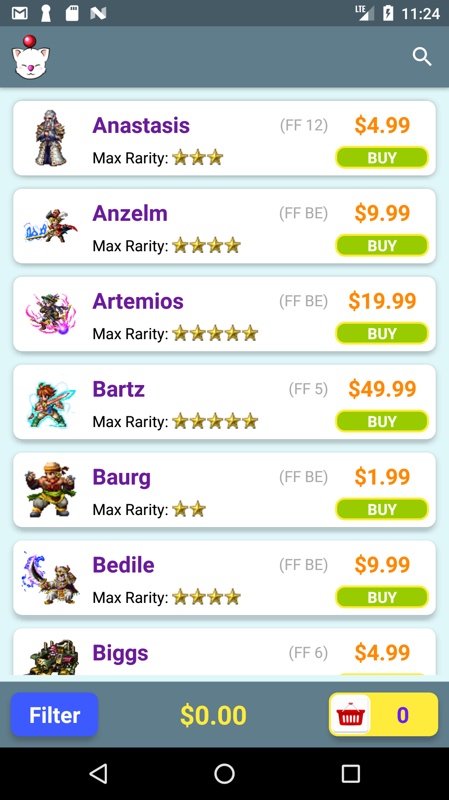
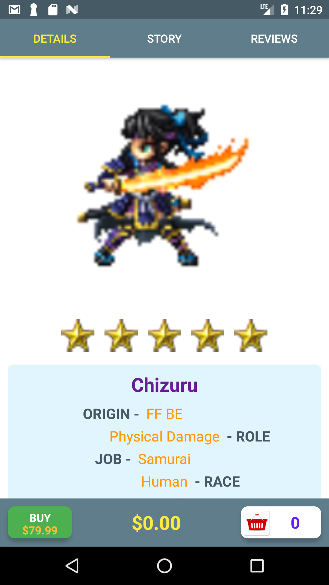
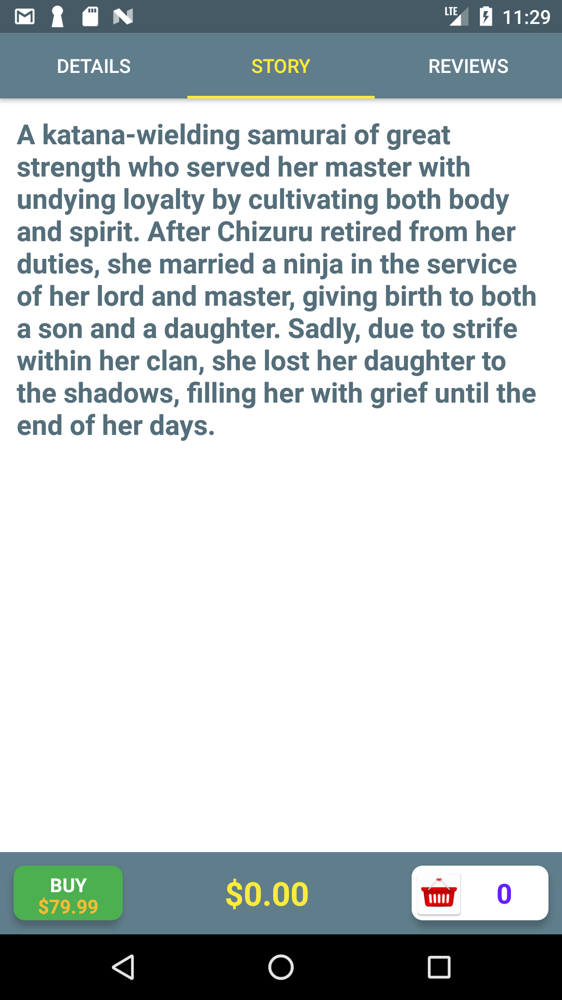
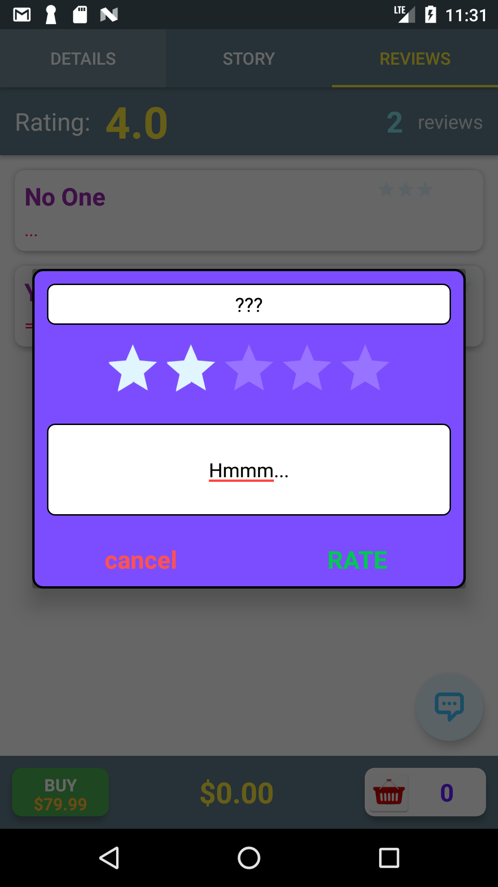
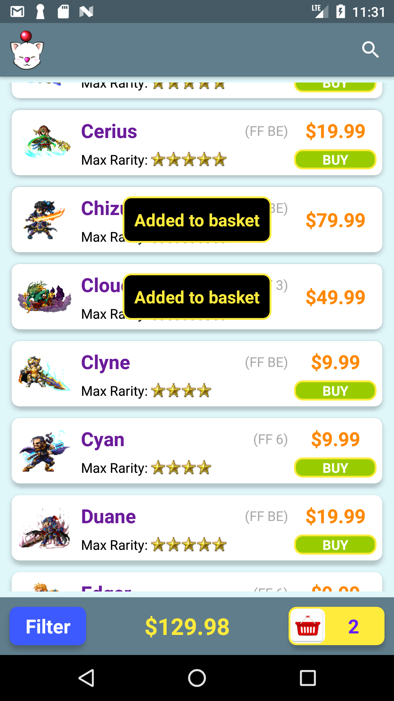
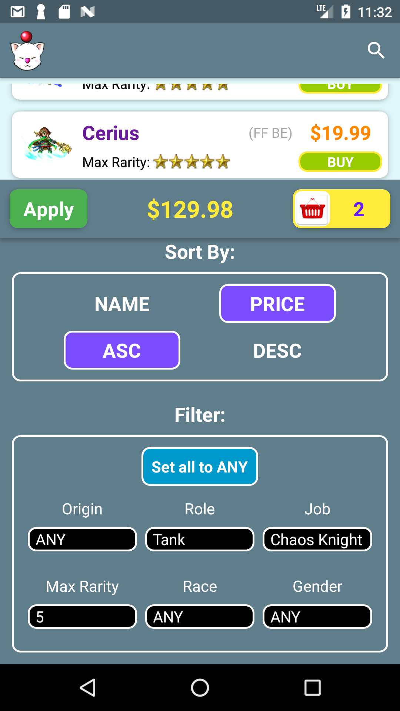
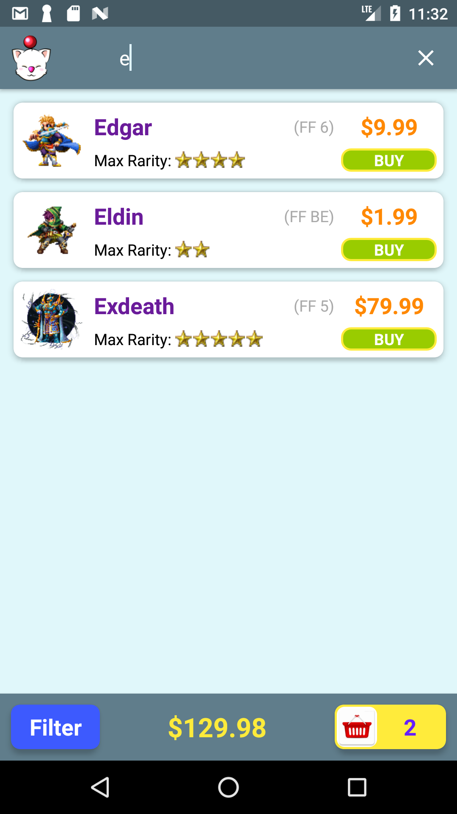
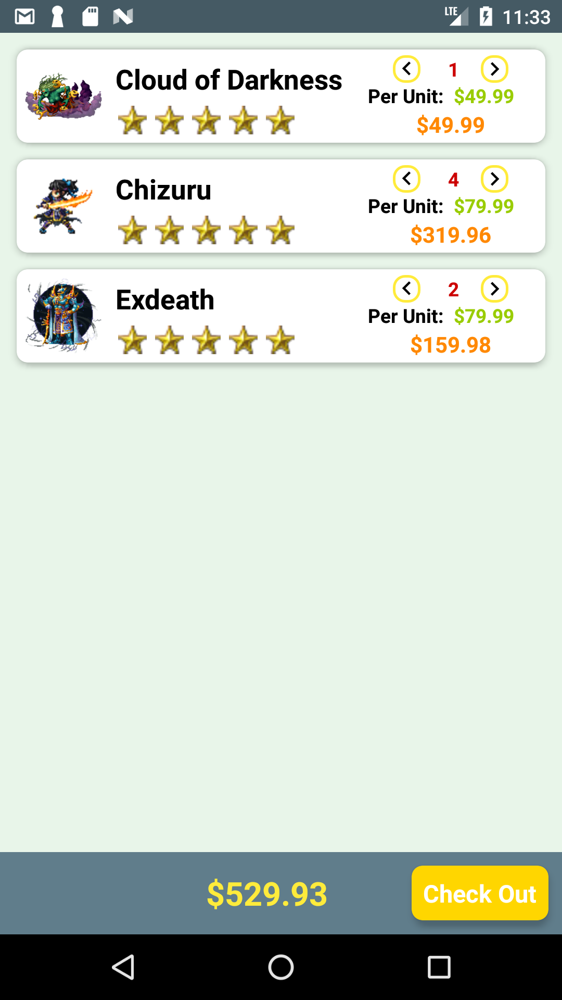
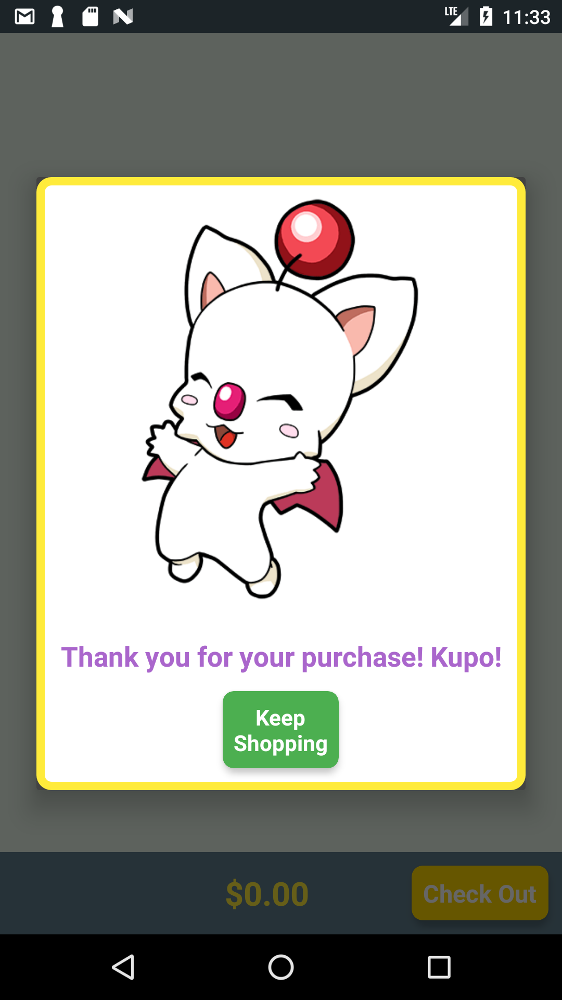

## Intro

A fake Ecommerce app that sells characters from the Final Fantasy: Brave Exvius mobile game. Note: current list of characters may not be up to date with the latest game version.

## Instructions for Use:

- Tap the magnifying glass icon at the top to enter a partial or full search parameter.
- Tap a character to view additional details such as Trust Mastery and story background. You can also give the character a rating and write a comment.
- Tap "Buy" on any screen to add character to the checkout basket.
- Use the Filter button to adjust list sorting and filter specific characters by type.
- Tap the Basket button to access the checkout basket. Here you can adjust the quantity of each item in the basket. Lowering the item count to zero automatically removes the item from the basket.
- Tapping "Check Out" will remove all items from the basket so you can start again.

## Screenshots

